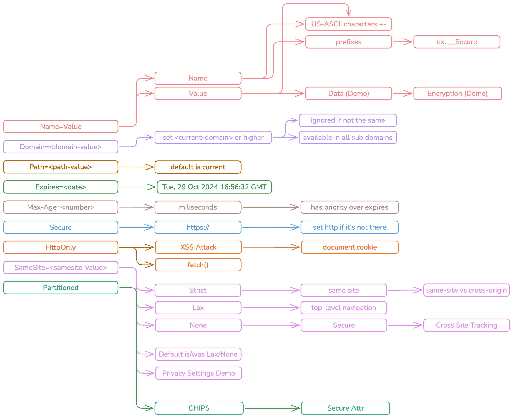

# Cookies Workshop

## Setup

- Generate Local SSL Certificates

```shell
openssl req -x509 -sha256 -nodes -newkey rsa:2048 -days 365 -keyout localhost.key -out localhost.crt
```

- Setup loopback interface to response to `127.0.0.2`

```shell
sudo ifconfig lo0 alias 127.0.0.2 up
```

- Map IPs to domains in `/etc/hosts` file

```shell
127.0.0.1    victim.local
127.0.0.2    attacker.local
```

## Start

### Start victim on 127.0.0.1

Accessible on

- [http://victim.local](http://victim.local)
- [https://victim.local](https://victim.local)

```shell
cd victim-app
npm start
```

Accessible on

- [http://attacker.local](http://attacker.local)
- [https://attacker.local](https://attacker.local)

```shell
cd attacker-app
npm start
```

## Cookie Mind map

